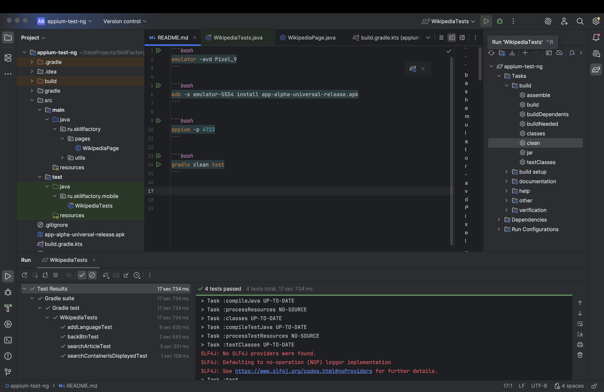

## Описание проекта:

Автоматизированные тесты для Web-сайта VK Video

## Технологии:

- Java 11+
- Selenium WebDriver
- TestNG
- Gradle

## Требования:

1. Java 11+
2. Gradle
3. Браузер Google Chrome

## Как запустить автотесты

## Клонируйте репозиторий:

```bash
git clone https://github.com/nikolay-977/selenium-test-ng
cd selenium-test-ng
```

## Запустите автотесты

```bash
gradle clean test
```

### Скриншот успешного запуска автотестов:

